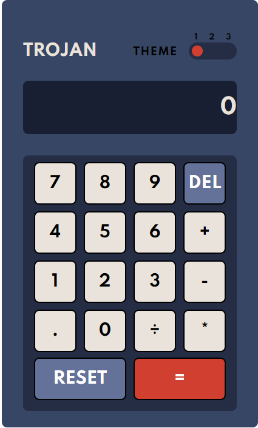

# Calculator app challenge

## Welcome! 👋
* Calculator app to do simple arithmetic operations, you can use the keyboard buttons or by clicking with the mouse on the buttons
* Next update will add 3 deferent themes, add more features and fix bugs.
* Please report me if you found any bugs. 
* App preview > [https://ahmedhll.github.io/Calculator-app/]

